# Lightsail Workshop
Welcome to the Lightsail Workshop! This guide will walk you through the process of setting up a To-Do List application on a Container using Amazon Lightsail.

Specifically, this workshop will cover:
- Creating the infrastructure you will use in the subsequent labs
- Deploying a two-tier To-Do List stack application in a Lightsail container
- Rearchitecting the application by separating the front-end from the database

## Table of Contents
- [Prerequisites](#prerequisites)
- [Step 0: Set up your AWS Cloud9 environment](#step-0-set-up-your-aws-cloud9-environment)
- [Step 1: Deploy an Amazon RDS MySQL Database](#step-1-deploy-an-amazon-rds-mysql-database)
- [Step 2: Verify the application locally](#step-2-verify-the-application-locally)
- [Step 3: Deploy the application to Amazon Lightsail](#step-3-deploy-the-application-to-amazon-lightsail)
- [Step 4: Use RDS as the database](#step-4-use-rds-as-the-database)
- [Conclusion](#Conclusion)

## Prerequisites

Ensure you have the following before embarking on this workshop:
- An Amazon Web Services (AWS) account
- Docker installed
- A Docker Hub Account (you can sign up [here](https://hub.docker.com/signup))
- Basic knowlege on Linux commands

## Step 0: Set up your AWS Cloud9 environment

To follow along this workshop, we recommend creating a Cloud9 environment in your AWS account as your Cloud IDE. While this workshop can be carried out using your local desktop, using Cloud9 will ensure consistency in the environment and avoid lab issues.

1. Sign into the AWS Management Console and open the AWS Cloud9 console

1. Click **Create environment**. In **Details** section, give the environment a name such as `gic-hackathon-cloud9`, and choose `New EC2 instance` for the Environment type.

1. In **New EC2 instance** section, choose `t3.small` for the instance type, `Amazon Linux 2` for the Platform and `30 minutes` for the Timeout.

1. Leave the rest of the fields as default and click **Create**.

    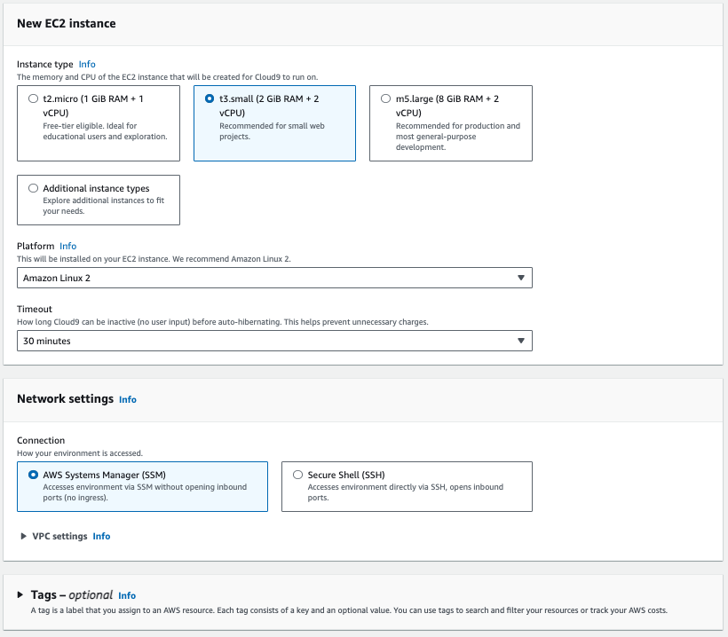

1. You will be brought back to Cloud9 console. Under **Cloud9 IDE** column, click the `Open` button. After a few seconds, you will see the Cloud9 IDE.

1. Open a new Terminal (Window > New Terminal), clone this GitHub repository and install the required libraries

    ```
    git clone https://github.com/bryancwh/lightsail-todo.git
    cd lightsail-todo/
    pip install -r requirements.txt
    ```

## Step 1: Deploy an Amazon RDS MySQL Database

In this section we will deploy an Amazon RDS MySQL database which will eventually be used as the database for the application. Amazon Relational Database Service (Amazon RDS) is a web service that makes it easier to set up, operate, and scale a relational database in the AWS Cloud. To learn more, visit [our website](https://aws.amazon.com/rds/).

1. Sign into the AWS Management Console and open the Amazon RDS console.

1. Click on `Create Database`.

    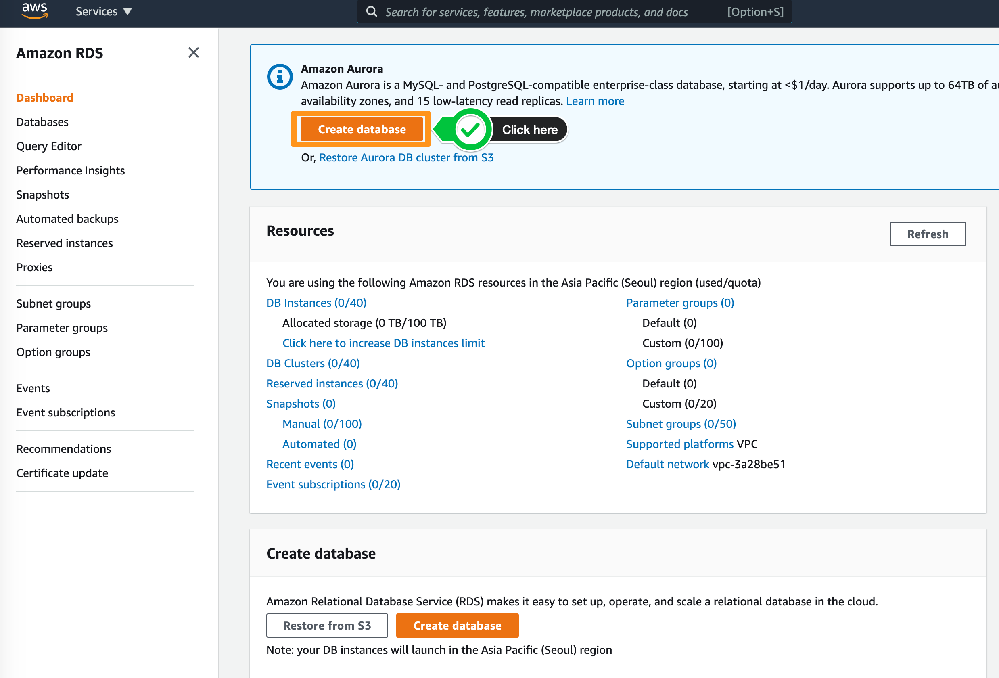

1. For **Choose a database creation method**, select `Standard Create` option. With Standard Create, you setup the configurations for your database.

1. Select `MySQL` in **Engine type**.

1. When you select MySQL as your database engine, the latest version will be automatically selected for you. For this lab, select MySQL version `8.0.33`.

1. For **Templates**, there are three options available: Production, Dev/Test and Free Tier. For the purpose of this workshop, we will select `Free Tier`.

1. Since we selected `Free Tier` which is generally used for workshop and non-Production purpose where Multi-AZ deployment is not required, the **Availability and Durability** section will be disabled for you.

1. In Settings section, fill in the following for each field:

    | Parameter              | Value         |
    |------------------------|---------------|
    | DB Instance Identifier | `awsdb`       |
    | Master Username        | `awsuser`     |
    | Master Password        | `awspassword` |

    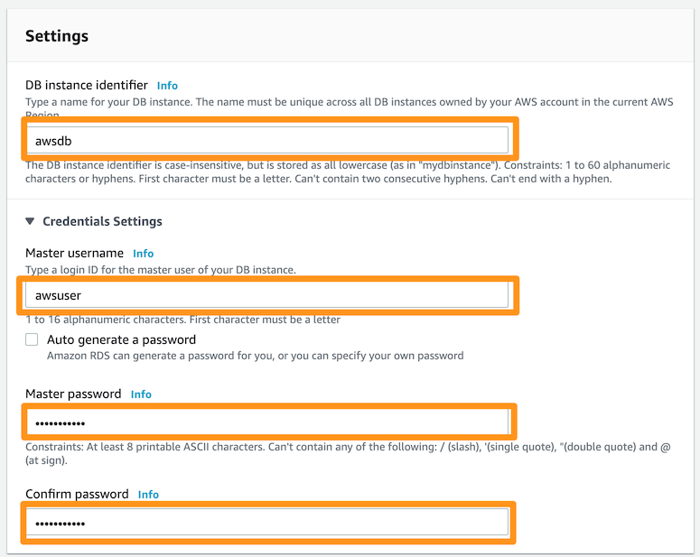

1. In **DB Instance size** section, for DB instance class, select burstable classes `db.t3.micro`. This option will be automatically selected for you.

1. In the **Storage** section, select the Storage Type as General Purpose SSD (gp2). Leave the rest as defaults.

1. In the **Connectivity** section, fill in the following for each field and leave the rest as defaults:
    
    | Parameter              | Value           |
    |------------------------|-----------------|
    | VPC                    | `Default VPC`   |
    | Subnet Group           | `default`       |
    | Publicly accessible	 | `No`            |
    | VPC Security Group(s)	 | `default`       |
    | Availability Zone      | `No preference` |

    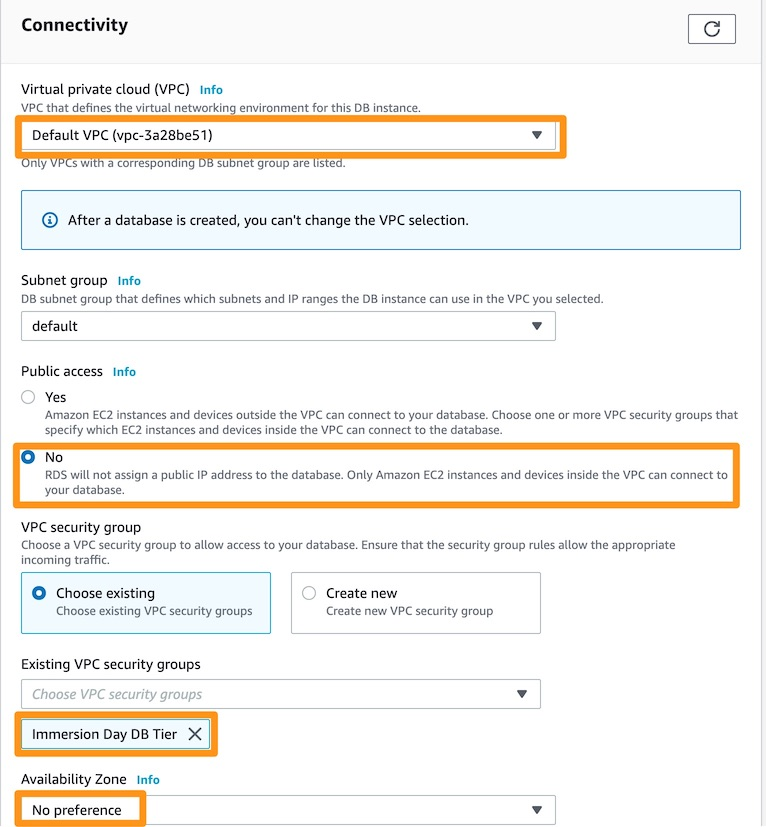

1. For **Database authentication**, select: `Password Authentication`.

1. Expand on **Additional Configuration**. For the **Database options**, provide the following:
    - Initial Database name: `lightsaildb`
    - DB Parameter group: `default.mysql8.0`
    - Option group: `default.mysql-8.0`

1. For **Backup**:
    - Check on `Enable automatic backups`
    - Backup retention period: `7 days`
    - Backup Window: `No preference`
    - Leave the rest as defaults

1. Review your settings and click Create database.

1. While the RDS database is creating, you can continue with the rest of the workshop.

## Step 2: Verify the Flask application locally

In this workshop, we are using the Python Flask web framework to build the simple To-Do List application. Any programming language and web framework that can run inside a container will also work with Amazon Lightsail.

1. Open the file called [todo.py](./todo.py).

1. Ensure the local database configuration is uncommented, and the RDS database configuration is commented out before saving the file. In this step, we are using a local SQL database, making it a monolith application.

    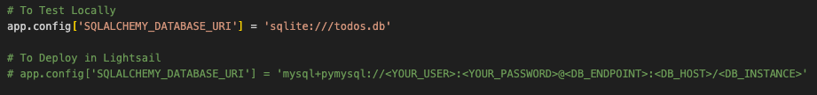

1. Open [Dockerfile](./Dockerfile) and verify the build.

1. In your terminal, build the application and run it to test

    ```
    docker build -t lightsail-todo-local .
    docker run -it --rm -p 8080:8080 lightsail-todo-local
    ```

1. In the Cloud9 top navbar, click Tools > Preview > Preview Running Application. You should see a pop-up browser on the right side of the IDE, showing the To-Do List application. Try adding several tasks, mark them as completed and then deleting them. You should also see GET/POST/DELETE API calls being logged in the Terminal.

    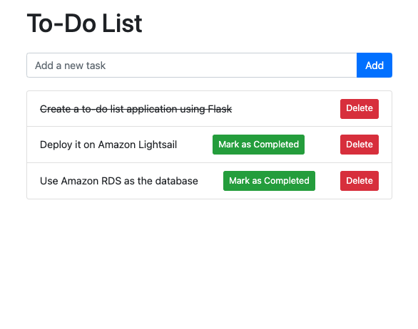

## Step 3: Deploy the application to Amazon Lightsail

### Step 3.1: Build and deploy the container to Docker Hub

1. Build the container 

    ```
    docker buildx build --platform linux/amd64 -t lightsail-todo .
    ```

1. Push the container to Docker Hub. Replace the username with your Docker Hub username.

    ```
    docker tag lightsail-todo <your Docker Hub username>/lightsail-todo
    docker login
    docker push <your Docker Hub username>/lightsail-todo
    ```

1. Go to Docker Hub and verify that your docker has been pushed

    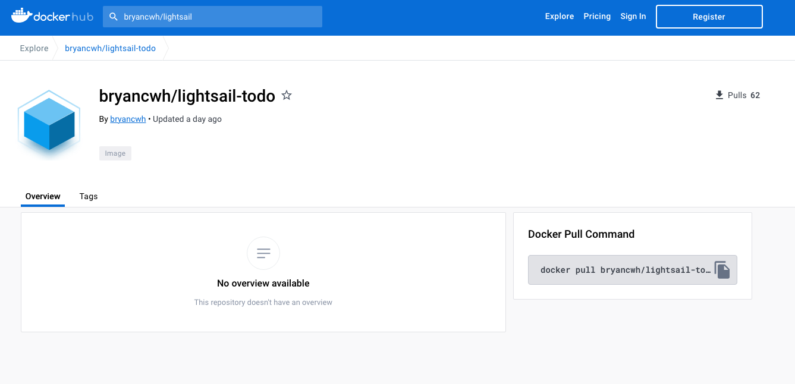

### Step 3.2: Create a Lightsail container service

Now that you have the container image on Docker Hub, let’s create a Lightsail Container Service.

1. Go to Amazon Lightsail console and on the sidebar, click `Containers` and click `Create container service`.

    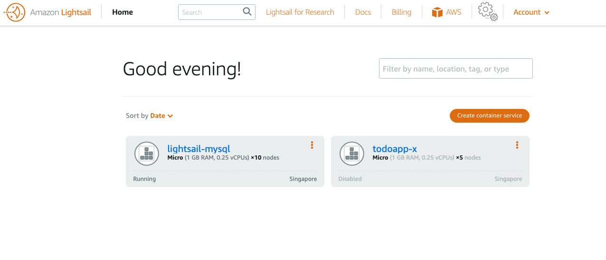

1. In **Select a Region** section, choose the correct AWS region (ask the facilitators if you are unsure) and make sure that it is in the same region as the Amazon RDS database that you have previously created.

1. Select the size of the container you want to use in terms of vCPU and memory available to my application. Select the number of container instances you want to run in parallel for high availability or scalability reasons. 

    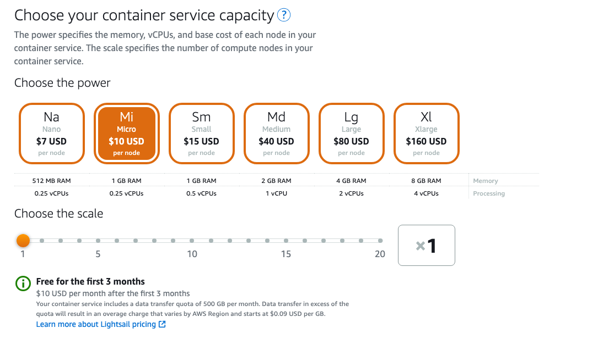

    > **_NOTE:_** You can change the number of container instances or their power (vCPU and RAM) at any time, without interrupting the service. 

1. Click on `Set up deployment` and choose `Specify a custom deployment`. Choose a name for your image e.g. `my-lightsail-container` and give the address of the image on Docker Hub. Click on `Open ports` and fill in `8080` port.

1. In **Public endpoint** section, choose the container that you have just created in the previous step. Port 8080 should be chosen automatically.

    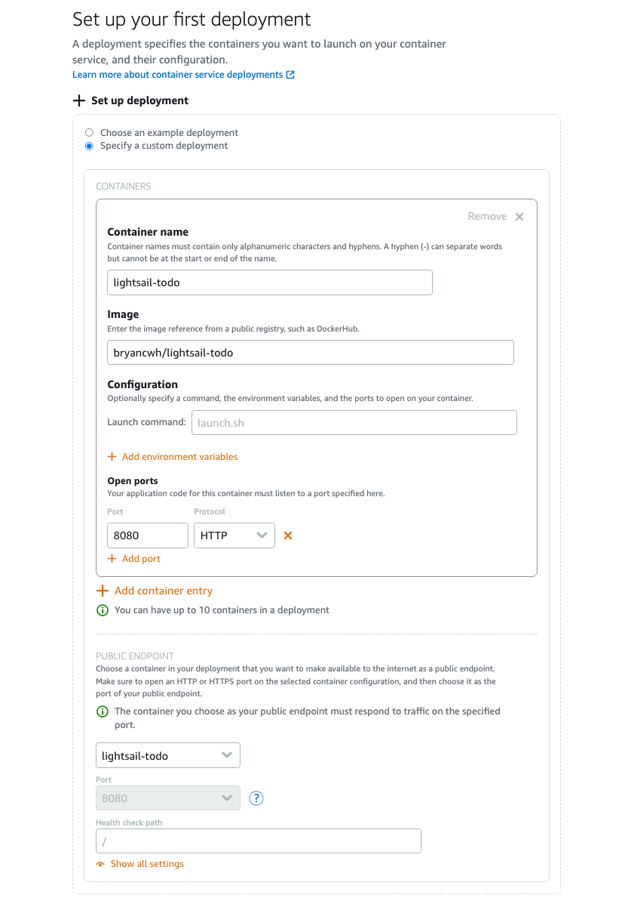


1. Specify a name for your container service e.g. `lightsail-todo`, and click `Create container service`.

    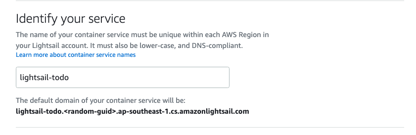

### Step 3.3: Verify the application

After a few minutes, your deployment is active and you can then test the endpoint.

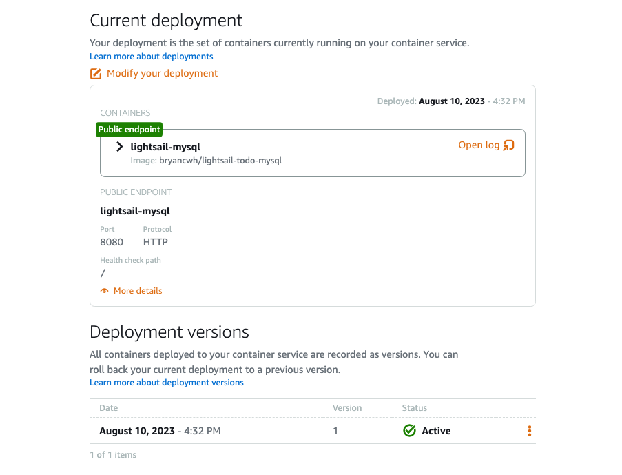

The endpoint URL is available on the top-right side of the Lightsail console in the format of `<container-service-name>.<random-guid>.<AWS region>.cs.amazonlightsail.com`. Click it.

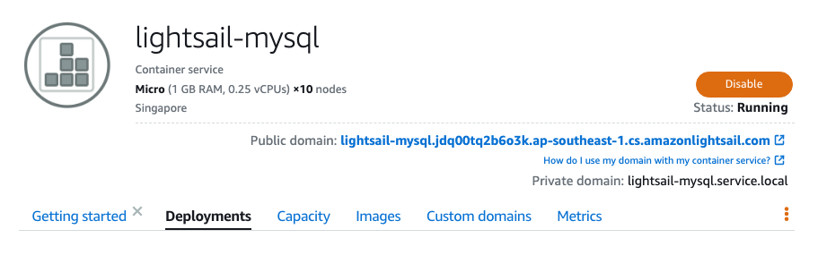

You should get see the To-Do List application:

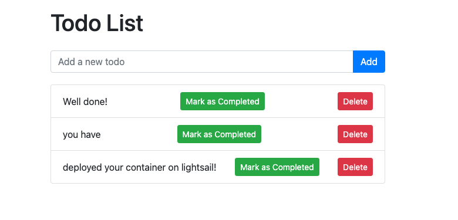

## Step 4: Use RDS as the database

Although the To-Do List application has been deployed to Amazon Lightsail, it is currently a monolithic application where the SQL database is within the same container as the application. This setup will make each container service as stateful and therefore we cannot scale the application independently from the database. In this section, we will replace the SQL database with the Amazon RDS MySQL database that we created earlier.

### Step 4.1: Enable VPC peering
In order for Lightsail resources to communicate with other AWS resources in a VPC, you need to enable VPC peering between Lightsail and the default AWS VPC for the same AWS region as your Lightsail resources. Note that Lightsail can only peer with the default AWS VPC.

1. Go to the Lightsail console home page and click **Account** in the top right corner. Choose `Account` from the pop out menu.

    

1. Click on `Advanced` from the horizontal menu

1. Under **VPC peering** check the `Enable VPC peering` box is checked for the AWS region where your application is deployed.

    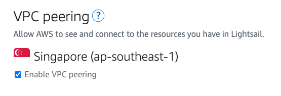

### Step 4.2: Edit RDS Security Group
The next step is to ensure that the security group for the RDS instance allows traffic from the Lightsail subnet.

1. Go to the **Amazon RDS console**.

1. Under **Database** click on the name of the database you created at the beginning of the workshop `awsdb`.

1. Under **Connectivity and security** click on the VPC security groups name.

    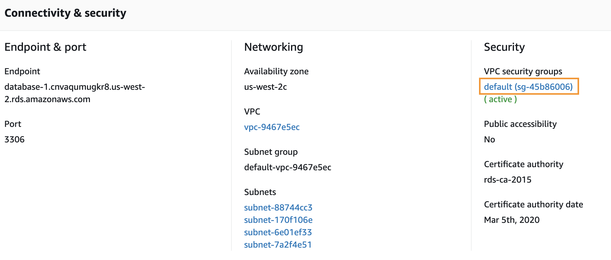

1. Click the **Inbound rules** tab near the bottom of the screen and click the `Edit inbound rules` button.

    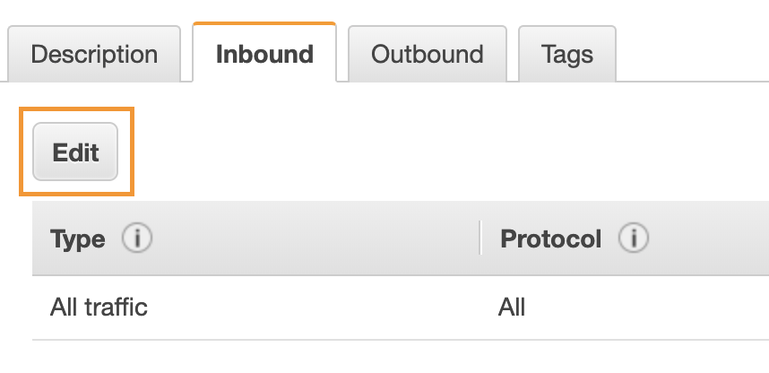

1. Click `Add rule` in the pop up box

1. From the **Type** drop down choose `MySQL/Aurora`. In the **Source** box enter `172.26.0.0/16` (this is the CIDR address for the Lightsail subnet).

    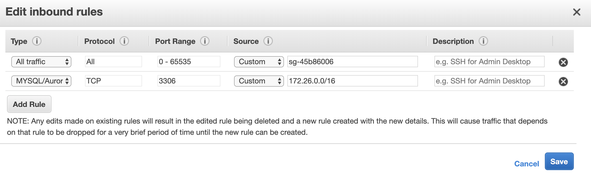

1. Click `Save rules`.

### Step 4.3: Use the RDS Endpoint in the Flask application

1. Return to the RDS console for your RDS database.

1. Under **Connectivity and security** copy the `Endpoint` value.

    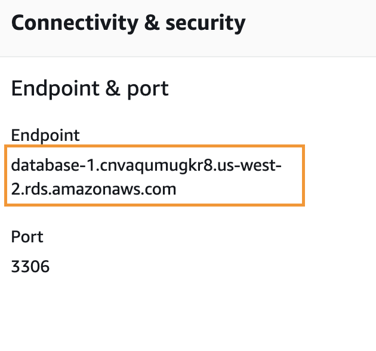

1. Go to your Cloud9 IDE and open Flask application [todo.py](./todo.py) file.

1. Comment out the local database configuration, uncomment the RDS database configuration and modify the `SQLAlchemy Database URI` with the RDS database endpoint and the username and password set during creation. For example `mysql+pymysql://awsuser:awspassword@<RDS_DB_ENDPOINT>:3306/lightsaildb`

    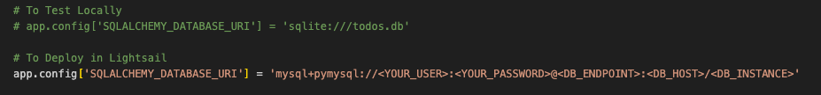

### Step 4.4: Create a new Lightsail deployment

Now that we have updated the application with the RDS endpoint, we need to update the Docker image and create a new Lightsail deployment using the latest image.

1. In the Cloud9 terminal, run the following commands:

    ```
        docker buildx build --platform linux/amd64 -t lightsail-todo .
        # Push to Docker Hub
        docker tag lightsail-todo <your Docker Hub username>/lightsail-todo:v2
        docker push <your Docker Hub username>/lightsail-todo:v2

    ```

1. Go to Amazon Lightsail console > Containers and click on the container service that we have created previously. Under **Deployments** tab, click `Modify your deployment` and add fill in the `Image` parameter with the v2 image URI, i.e. `<your Docker Hub username>/lightsail-todo:v2`.

1. Click `Save and deploy`. You should now see 2 deployment versions with the version 2 in `Deploying` status.

    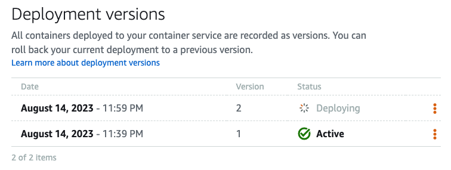

1. After a few minutes, the version 2 deployment should show as `Active`. Access the website and you will note that the previously added tasks are not visible now. This is expected because the tasks were stored in the MySQL database within the application container, whereas now we are using RDS MySQL database to store the tasks. Now try adding several tasks, mark them as completed and then deleting them.

## Conclusion
Congratulations! You have successfully set up a To-Do List application using the Amazon Lightsail Container service. You now have a functional environment for hosting websites and applications that require a web server, database, and server-side scripting.
